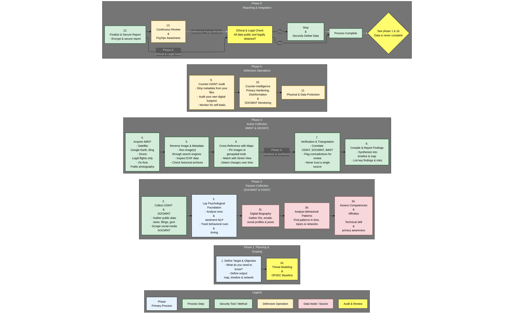

# Three letter agencies

Three-letter agencies, such as the FBI, CIA, or NSA, deploy a range of investigative techniques on threat actors that include protective intelligence and threat assessment investigations, as well as cyber threat hunting methodologies.

Protective intelligence investigative techniques focus on identifying and assessing individuals who pose threats to public officials or important targets. This involves gathering and analyzing information from diverse sources such as interviews, background checks, digital footprints, weapon and travel records, and behavioral analysis to evaluate the threat level. Investigators use methods including interviews, searches (of people, residences, vehicles), background checks, and reviewing communications or purchases to create a comprehensive threat profile. The goal is to prevent attacks by monitoring and intervening based on the threat assessment.

On the cyber side, agencies use threat hunting techniques such as Indicators of Compromise (IOCs) analysis, which involves searching logs and network traffic for digital signs of malicious activity. They also employ analysis of Tactics, Techniques, and Procedures (TTPs) to understand how threat actors conduct attacks, allowing more efficient detection and response tailored to known attacker behaviors. Digital forensics and incident response (DFIR) investigations help identify, investigate, and remediate cyberattacks within networks by thorough review of logs, file systems, and user activities.

The flowchart example provided aligns well with the investigative and operational framework that a three-letter agency might deploy against a threat actor. It includes structured phases such as:

- Foundation and Planning, which aligns with defining the target, objectives, and gathering preliminary intelligence.
- Intelligence Gathering, involving psychological analysis such as tone and behavior, plus collection from OSINT, SOCMINT (social media intelligence), and image intelligence (IMINT).
- Analysis and Verification phases that involve processing diverse data sources, cross-referencing, reverse image and metadata analysis, and triangulation which is critical in threat validation.
- Defensive operations focused on privacy hardening, counter-intelligence, and OPSEC (operational security) methods.
- Continuous reporting and auditing to ensure legality, ethics, and ongoing threat assessment.

This comprehensive cycle mirrors the protective intelligence investigative practices used by agencies, including gathering multi-source data (interviews, records, digital footprints), behavioral analysis, verification, and deploying defensive countermeasures and secure reporting. It also emphasizes OPSEC and legal compliance, which are essential procedural elements for formal sensitive investigations. A three-letter federal agency (like the FBI, NSA, or CIA in the U.S.) investigating a threat actor would operate with **broader jurisdiction, deeper technical resources, and expanded intelligence authorities** than a state police agency. While state police focus narrowly on admissible evidence for prosecution within their state, federal agencies can employ intelligence-driven methods, international cooperation, and advanced cyber capabilities.  

### Jurisdiction & Authority
- **State Police:** Limited to their state boundaries, needing coordination with other states or federal partners for cross-border crimes.  
- **Federal Agency:** Operates across state lines and internationally, often working with foreign intelligence services, Interpol, and allied agencies. They can investigate threat actors targeting national security, critical infrastructure, or transnational crimes.

### Legal & Intelligence Framework
- **State Police:** Bound strictly to criminal procedure, subpoenas, and warrants, emphasizing courtroom-admissible evidence.  
- **Federal Agency:** Can use both law enforcement tools (subpoenas, wiretaps under federal statutes) and **classified intelligence collection** under authorities like FISA (Foreign Intelligence Surveillance Act). Evidence and intelligence may be separated (parallel construction) to protect sensitive sources.  

### Intelligence Disciplines & Tools
- **State Police:** Forensics, subpoenas to ISPs, HUMINT through interviews, limited surveillance.  
- **Federal Agency:**  
  - **SIGINT (Signals Intelligence):** Monitoring communications at scale (when legally authorized).  
  - **FININT (Financial Intelligence):** Tracking cryptocurrency and international money flows.  
  - **IMINT/GEOINT:** Satellite and geospatial imagery to confirm movements or facilities.  
  - **SOCMINT/OSINT at scale:** Automated scraping and AI-assisted correlation with government-only datasets.  
  - **Human Sources:** May deploy clandestine HUMINT assets or flip insiders close to the threat actor.  

### Technical Capability
- **State Police:** Relies on off-the-shelf digital forensics labs, commercial OSINT tools, cooperation with ISPs.  
- **Federal Agency:** Access to undisclosed cyber exploitation tools (zero-days, implants), high-budget forensic capabilities, and classified datasets not available to state authorities. Can deanonymize actors who rely on advanced OPSEC with far higher success rates.

### Objectives
- **State Police:** Prosecute an individual in court, secure a conviction, and protect the public in the immediate jurisdiction.  
- **Federal Agency:** Broader national security mandate. May prioritize **intelligence collection over immediate prosecution**. They may track the threat actor covertly to map their network, identify sponsors, or exploit them for counterintelligence value instead of arresting them quickly.

### Coordination & Oversight
- **State Police:** Reports to local DA or state AG, oversight rooted in state law.  
- **Federal Agency:** Reports to federal prosecutors, national security councils, or even directly to executive leadership. Oversight may involve congressional intelligence committees but allows for classified and covert avenues unavailable to state entities.

### Example Difference in Action
- If a **threat actor** is a domestic harasser, state police will focus on subpoenas, arrests, and presenting the case to a local prosecutor.  
- If the **same threat actor** has ties overseas, uses encrypted networks, or threatens critical infrastructure, a federal agency (FBI or NSA) might:  
  - Use national SIGINT collection to pierce their anonymization.  
  - Identify whether they are linked to foreign intelligence.  
  - Run ongoing surveillance instead of immediately disclosing the findings.  
  - Build a strategic case involving international partners rather than just a local prosecution.
    

In additon:

### Common Investigative Techniques

- **Confidential Informants:** The use of civilian informants who covertly provide information to law enforcement is closely regulated. Agencies like the FBI have to comply with formal guidelines on recruitment, handling, and validation of informants to ensure reliability and legal compliance.

- **Undercover Operations:** These involve agents assuming fictitious identities to infiltrate criminal groups or networks. Undercover work is only undertaken when traditional investigative methods are insufficient, and each operation requires rigorous justification and supervision.

- **Physical and Electronic Surveillance:** Surveillance techniques range from in-person stakeouts (physical surveillance) to technical approaches like wiretaps or electronic monitoring, which require specialized protocols and court authorization. For example, Title III wiretaps under 18 U.S.C. § 2518 demand evidence that other methods have failed or are too dangerous.

- **Polygraph Examinations:** Federal agencies may use polygraphs as an investigatory tool, especially for assessing the reliability of informants, though use is limited and results are not typically admissible in court.

- **Subpoenas and Legal Process:** Agencies use subpoenas to obtain testimony or records crucial to investigations. Subpoenas can require individuals to appear before a court (testimonial) or submit documents (records subpoenas).

- **Non-consensual Monitoring and Title III Orders:** When monitoring private communications, special procedures including affidavits and judicial review are necessary. Agencies must provide a detailed rationale and show why less intrusive means cannot achieve investigative goals.

### Special Considerations

- **Attorney-Client and Media Protections:** Searches that could involve privileged materials (for example, those belonging to attorneys or journalists) require “filter teams” and additional safeguards to respect legal privileges, with oversight as codified in DOJ policy and regulation.

- **Coordination and Task Forces:** These agencies often participate in interagency collaborations such as Joint Terrorism Task Forces or Financial Investigative Task Forces, which combine resources and techniques from multiple agencies to pursue complex investigations.

All of the above techniques are strictly regulated, requiring documentation, judicial oversight, and compliance with specific guidelines to protect individual constitutional rights and the integrity of investigations.

back to the [main guide](../../README.md)
