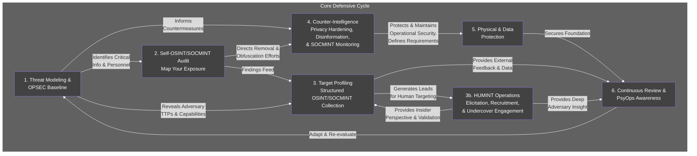

```mermaid
flowchart TB
 subgraph subGraph0["Core Defensive Cycle"]
        A["1. Threat Modeling &amp;<br>OPSEC Baseline"]
        B["2. Self-OSINT/SOCMINT Audit<br>Map Your Exposure"]
        C["3. Target Profiling<br>Structured OSINT/SOCMINT Collection"]
        H["3b. HUMINT Operations<br>Elicitation, Recruitment,<br>&amp; Undercover Engagement"]
        D["4. Counter-Intelligence<br>Privacy Hardening, Disinformation,<br>&amp; SOCMINT Monitoring"]
        E["5. Physical &amp; Data<br>Protection"]
        F["6. Continuous Review &amp;<br>PsyOps Awareness"]
  end
    A -- Identifies Critical<br>Info &amp; Personnel --> B
    B -- Findings Feed --> C
    A -- Reveals Adversary<br>TTPs &amp; Capabilities --> C
    C -- Generates Leads<br>for Human Targeting --> H
    H -- Provides Insider<br>Perspective &amp; Validation --> C
    A -- Informs<br>Countermeasures --> D
    B -- Directs Removal &amp;<br>Obfuscation Efforts --> D
    D -- "Protects &amp; Maintains<br>Operational Security.<br>Defines Requirements" --> E
    E -- Secures Foundation --> F
    C -- Provides External<br>Feedback &amp; Data --> F
    H -- Provides Deep<br>Adversary Insight --> F
    F -- "Adapt & Re-evaluate" --> A

    style A color:#FFFFFF,fill:#424242
    style B color:#FFFFFF,fill:#424242
    style C color:#FFFFFF,fill:#424242
    style H color:#FFFFFF,fill:#424242
    style D color:#FFFFFF,fill:#424242
    style E color:#FFFFFF,fill:#424242
    style F color:#FFFFFF,fill:#424242
    style subGraph0 fill:#616161,stroke:none,color:#FFFFFF
    linkStyle 0 stroke:#FFFFFF,fill:none
    linkStyle 1 stroke:#FFFFFF,fill:none
    linkStyle 2 stroke:#FFFFFF,fill:none
    linkStyle 3 stroke:#FFFFFF,fill:none
    linkStyle 4 stroke:#FFFFFF,fill:none
    linkStyle 5 stroke:#FFFFFF,fill:none
    linkStyle 6 stroke:#FFFFFF,fill:none
    linkStyle 7 stroke:#FFFFFF,fill:none
    linkStyle 8 stroke:#FFFFFF,fill:none
    linkStyle 9 stroke:#FFFFFF,fill:none
    linkStyle 10 stroke:#FFFFFF,fill:none
    linkStyle 11 stroke:#FFFFFF,fill:none
```
