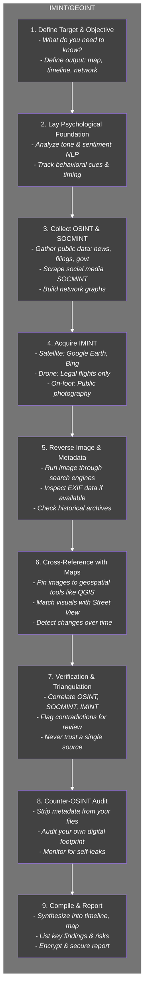

```mermaid
flowchart LR
 subgraph subGraph0["IMINT/GEOINT"]
        A["1. Define Target &amp; Objective<br>- <i>What do you need to know?<br>- Define output: map, timeline, network</i>"]
        B["2. Lay Psychological Foundation<br>- <i>Analyze tone &amp; sentiment NLP<br>- Track behavioral cues &amp; timing</i>"]
        C["3. Collect OSINT &amp; SOCMINT<br>- <i>Gather public data: news, filings, govt<br>- Scrape social media SOCMINT<br>- Build network graphs</i>"]
        D["4. Acquire IMINT<br>- <i>Satellite: Google Earth, Bing<br>- Drone: Legal flights only<br>- On-foot: Public photography</i>"]
        E["5. Reverse Image &amp; Metadata<br>- <i>Run image through search engines<br>- Inspect EXIF data if available<br>- Check historical archives</i>"]
        F["6. Cross-Reference with Maps<br>- <i>Pin images to geospatial tools like QGIS<br>- Match visuals with Street View<br>- Detect changes over time</i>"]
        G["7. Verification &amp; Triangulation<br>- <i>Correlate OSINT, SOCMINT, IMINT<br>- Flag contradictions for review<br>- Never trust a single source</i>"]
        H["8. Counter-OSINT Audit<br>- <i>Strip metadata from your files<br>- Audit your own digital footprint<br>- Monitor for self-leaks</i>"]
        I["9. Compile &amp; Report<br>- <i>Synthesize into timeline, map<br>- List key findings &amp; risks<br>- Encrypt &amp; secure report</i>"]
  end
    A --> B
    B --> C
    C --> D
    D --> E
    E --> F
    F --> G
    G --> H
    H --> I

    style A color:#FFFFFF,fill:#424242
    style B color:#FFFFFF,fill:#424242
    style C fill:#424242,color:#FFFFFF
    style D fill:#424242,color:#FFFFFF
    style E color:#FFFFFF,fill:#424242
    style F color:#FFFFFF,fill:#424242
    style G fill:#424242,color:#FFFFFF
    style H color:#FFFFFF,fill:#424242
    style I color:#FFFFFF,fill:#424242
    style subGraph0 fill:#757575,stroke:none,color:#FFFFFF
    linkStyle 0 stroke:#FFFFFF,fill:none
    linkStyle 1 stroke:#FFFFFF,fill:none
    linkStyle 2 stroke:#FFFFFF,fill:none
    linkStyle 3 stroke:#FFFFFF,fill:none
    linkStyle 4 stroke:#FFFFFF,fill:none
    linkStyle 5 stroke:#FFFFFF,fill:none
    linkStyle 6 stroke:#FFFFFF,fill:none
    linkStyle 7 stroke:#FFFFFF,fill:none
```
