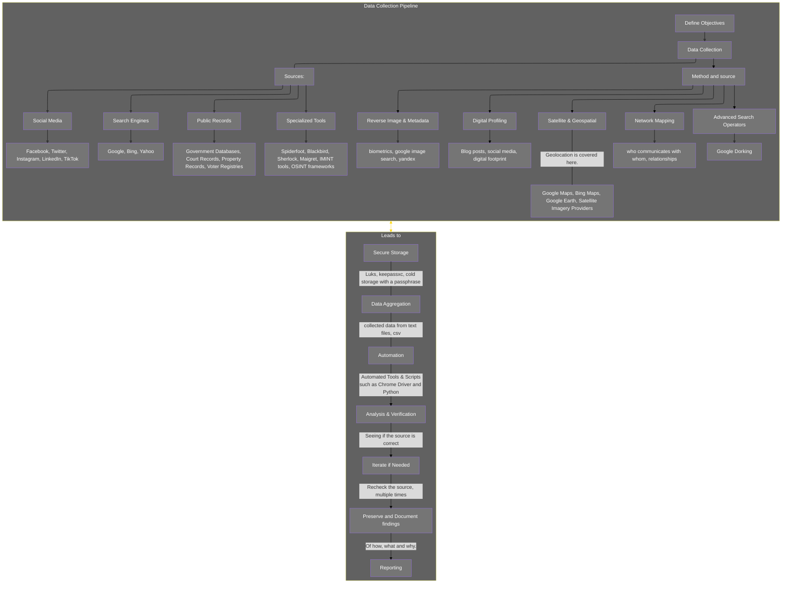

```mermaid
---
config:
  layout: elk
---
flowchart TB
 subgraph s1["Data Collection Pipeline"]
        A["Define Objectives"]
        B["Data Collection"]
        C["Sources:"]
        C1["Search Engines"]
        C2["Social Media"]
        C3["Public Records"]
        C4["Satellite &amp; Geospatial"]
        C5["Specialized Tools"]
        C1a["Google, Bing, Yahoo"]
        C2a["Facebook, Twitter, Instagram, LinkedIn, TikTok"]
        C3a["Government Databases, Court Records, Property Records, Voter Registries"]
        C4a["Google Maps, Bing Maps, Google Earth, Satellite Imagery Providers"]
        C5a["Spiderfoot, Blackbird, Sherlock, Maigret, IMINT tools, OSINT frameworks"]
        D1["Advanced Search Operators"]
        D2["Digital Profiling"]
        D3["Reverse Image & Metadata"]
        D5["Network Mapping"]
        D1a["Google Dorking"]
        D2a["Blog posts, social media, digital footprint"]
        D3a["biometrics, google image search, yandex"]
        D5a["who communicates with whom, relationships"]
        n1["Method and source"]
  end
 subgraph s2["Leads to"]
        n4["Analysis &amp; Verification"]
        H3["Data Aggregation"]
        H["Automation"]
        F["Iterate if Needed"]
        G["Preserve and Document findings"]
        G1["Secure Storage"]
        G3["Reporting"]
  end
    A --> B
    B --- C
    C --> C1 & C2 & C3 & C5
    C1 --> C1a
    C2 --> C2a
    C3 --> C3a
    C4 -- "Geolocation is covered here." --- C4a
    C5 --> C5a
    D1 --> D1a
    D2 --> D2a
    D3 --> D3a
    D5 --> D5a
    B --> n1
    n1 --> C4 & D1 & D5 & D3 & D2
    H3 -- "<span style=padding-left:>collected data from text files, csv</span>" --- H
    n4 -- Seeing if the source is correct --> F
    F -- Recheck the source, multiple times --> G
    G -- "<span style=padding-left:>Of how, what and why.</span>" --> G3
    G1 -- Luks, keepassxc, cold storage with a passphrase --- H3
    H -- "<span style=padding-left:>Automated Tools &amp; Scripts<br></span>such as Chrome Driver and Python" --> n4
    s1 <--> s2

    n1@{ shape: rect}
    n4@{ shape: rect}
    style A   fill:#757575,color:#FFFFFF
    style B   fill:#757575,color:#FFFFFF
    style C   fill:#757575,color:#FFFFFF
    style C1  fill:#757575,color:#FFFFFF
    style C2  fill:#757575,color:#FFFFFF
    style C3  fill:#757575,color:#FFFFFF
    style C4  fill:#757575,color:#FFFFFF
    style C5  fill:#757575,color:#FFFFFF
    style C1a fill:#757575,color:#FFFFFF
    style C2a fill:#757575,color:#FFFFFF
    style C3a fill:#757575,color:#FFFFFF
    style C4a fill:#757575,color:#FFFFFF
    style C5a fill:#757575,color:#FFFFFF
    style D1  fill:#757575,color:#FFFFFF
    style D2  fill:#757575,color:#FFFFFF
    style D3  fill:#757575,color:#FFFFFF
    style D5  fill:#757575,color:#FFFFFF
    style D1a fill:#757575,color:#FFFFFF
    style D2a fill:#757575,color:#FFFFFF
    style D3a fill:#757575,color:#FFFFFF
    style D5a fill:#757575,color:#FFFFFF
    style n1   fill:#757575,color:#FFFFFF
    style n4 fill:#757575,color:#FFFFFF
    style H3  fill:#757575,color:#FFFFFF
    style H   fill:#757575,color:#FFFFFF
    style F   fill:#757575,color:#FFFFFF
    style G   fill:#757575,color:#FFFFFF
    style G1  fill:#757575,color:#FFFFFF
    style G3  fill:#757575,color:#FFFFFF
    style s1 color:#FFFFFF,fill:#616161
    style s2 fill:#616161,color:#FFFFFF
    linkStyle 0 Stroke:#000000,fill:none
    linkStyle 1 Stroke:#000000,fill:none
    linkStyle 2 Stroke:#000000,fill:none
    linkStyle 3 Stroke:#000000,fill:none
    linkStyle 4 Stroke:#000000,fill:none
    linkStyle 5 Stroke:#000000,fill:none
    linkStyle 6 Stroke:#000000,fill:none
    linkStyle 7 Stroke:#000000,fill:none
    linkStyle 8 Stroke:#000000,fill:none
    linkStyle 9 Stroke:#000000,fill:none
    linkStyle 10 Stroke:#000000,fill:none
    linkStyle 11 Stroke:#000000,fill:none
    linkStyle 12 stroke:#000000,fill:none
    linkStyle 13 Stroke:#000000,fill:none
    linkStyle 14 Stroke:#000000,fill:none
    linkStyle 15 stroke:#000000,fill:none
    linkStyle 16 stroke:#000000,fill:none
    linkStyle 17 stroke:#000000,fill:none
    linkStyle 18 stroke:#000000,fill:none
    linkStyle 19 stroke:#000000,fill:none
    linkStyle 20 stroke:#000000,fill:none
    linkStyle 21 stroke:#000000,fill:none
    linkStyle 22 stroke:#000000,fill:none
    linkStyle 23 stroke:#000000,fill:none
    linkStyle 24 stroke:#000000,fill:none
    linkStyle 25 stroke:#000000,fill:none
    linkStyle 26 stroke:#000000,fill:none
    linkStyle 27 stroke:#FFD600,fill:none
```
