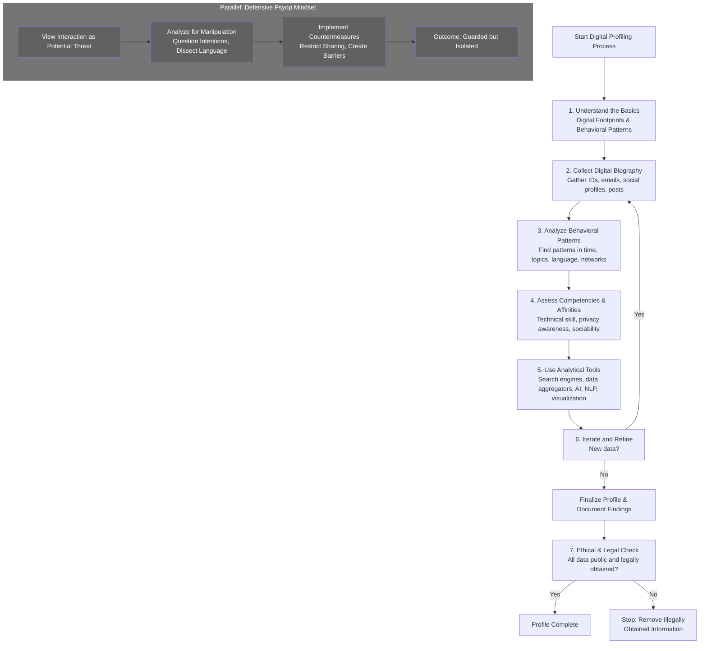

```mermaid
flowchart TB
 subgraph DefensiveMindset["Parallel: Defensive Psyop Mindset"]
        M["Analyze for Manipulation<br>Question Intentions, Dissect Language"]
        L["View Interaction as Potential Threat"]
        N["Implement Countermeasures<br>Restrict Sharing, Create Barriers"]
        O["Outcome: Guarded but Isolated"]
  end
    A["Start Digital Profiling Process"] --> B["1. Understand the Basics<br>Digital Footprints &amp; Behavioral Patterns"]
    B --> C["2. Collect Digital Biography<br>Gather IDs, emails, social profiles, posts"]
    C --> D["3. Analyze Behavioral Patterns<br>Find patterns in time, topics, language, networks"]
    D --> E["4. Assess Competencies &amp; Affinities<br>Technical skill, privacy awareness, sociability"]
    E --> F["5. Use Analytical Tools<br>Search engines, data aggregators, AI, NLP, visualization"]
    F --> G["6. Iterate and Refine<br>New data?"]
    G -- Yes --> C
    G -- No --> H["Finalize Profile & Document Findings"]
    H --> I["7. Ethical &amp; Legal Check<br>All data public and legally obtained?"]
    I -- Yes --> J["Profile Complete"]
    I -- No --> K["Stop: Remove Illegally<br>Obtained Information"]
    L --> M
    M --> N
    N --> O

    style M fill:#616161,color:#FFFFFF
    style L color:#FFFFFF,fill:#616161
    style N color:#FFFFFF,fill:#616161
    style O color:#FFFFFF,fill:#616161
    style DefensiveMindset fill:#757575,stroke:none,color:#FFFFFF
```
