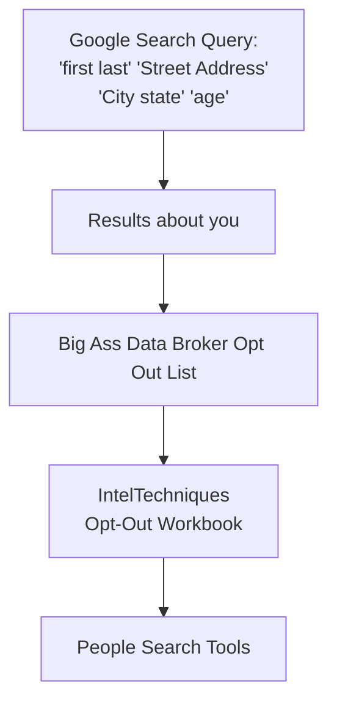

```mermaid
flowchart TD
    A@{ label: "Google Search Query:<br>'first last' 'Street Address'<br>'City state' 'age'" } --> B["Results about you"]
    B --> C["Big Ass Data Broker Opt Out List"]
    C --> D["IntelTechniques<br>Opt-Out Workbook"]
    D --> E["People Search Tools"]

    A@{ shape: rect}
    click B "https://myactivity.google.com/results-about-you"
    click C "https://github.com/yaelwrites/Big-Ass-Data-Broker-Opt-Out-List"
    click D "https://inteltechniques.com/workbook.html"
```
