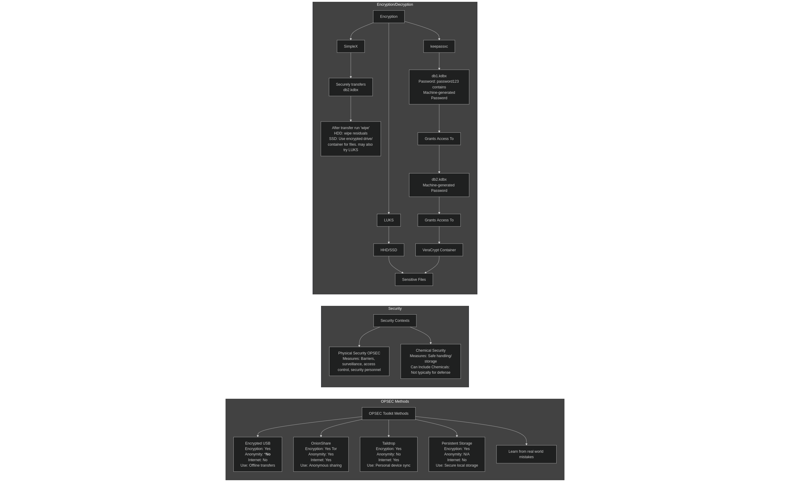

# OPSEC Toolkit

A comprehensive guide to operational security tools and techniques.

## Table of Contents
- [OPSEC Methods](#opsec-methods)
- [Content Obfuscation](#content-obfuscation)
- [Image Generation & Editing](#image-generation--editing)
- [Anonymity Tools](#anonymity-tools)
    - [Trying TailsOS](#to-try-tailsos-unsecure)
    - [i2p with TailsOS](#i2p-with-TailsOS-not-supported-but-is-amnesic)
    - [Secure File Transfer (TailsOS)](#secure-file-transfer-methods-in-tailsos)
    - [How to verify an onion address](#how-to-verify-an-onion-address)
- [Virtualization](#virtualization)
- [Privacy Protection](#privacy-protection)
- [Cryptocurrency](#cryptocurrency)
- [Data Destruction](#data-destruction)
- [Miscellaneous](#miscellaneous)
- [External Links](#external-links)
- [References](#references)
- back to [main guide](../README.md)

---

## OPSEC Methods

<p align="center">

</p>

## Content Obfuscation

### Text Rewriting Tools
- [Free Article Spinner](https://free-article-spinner.com/) - Basic and advanced paraphrasing.
- [RewriteTools](https://www.rewritertools.com/article-spinner) - Simple article spinner.
- [SEO Tool Station](https://seotoolstation.com/article-rewriter) - SEO-focused rewriter (use Tor after few attempts).
- [ChatGPT](https://chatgpt.com/) - "Rewrite this as..." prompt (censorship aware).
- [DeepSeek](https://chat.deepseek.com/) - Requires account (censored on sensitive topics).
  - [Offline Version Guide](https://ihsoyct.github.io/r/AIAssisted/comments/1ibv6g8/how_to_run_deepseek_r1_offline_on_your_computer/).
  - [LM Studio](https://lmstudio.ai/) - For running models locally.

Protip: Doesn't hurt to write genuinely, act human and be human if doing [HUMINT](./HUMINT.md).

### Multilingual Tools
- [Google Translate](https://translate.google.com/) - For language conversion.

---

## Image Generation & Editing

### Generation Tools
- [Stable Diffusion WebUI](https://github.com/AUTOMATIC1111/stable-diffusion-webui) - Local image generation.
  - [Civitai Model Repository](https://civitai.com/models) - Use 1.5 models for older GPUs.
- [This Person Does Not Exist](https://thispersondoesnotexist.com/) - Quick face generation (has watermark).

### Editing Tools
- [Free Inpaint](https://pincel.app/tools/inpaint) - Web-based inpainting
  - Pair with [Upscale Media](https://www.upscale.media/)
- [IOPaint](https://github.com/Sanster/IOPaint) - Local CPU-based inpainting
  - [Linux Launcher](https://github.com/airborne-commando/iopaint-launcher/)
- [DeepMosaics](https://github.com/HypoX64/DeepMosaics) (**note** requires CPU or NVIDIA GPU + CUDA CuDNN but is really good at getting rid of mosaics)
- [de-pixelate](https://github.com/KoKuToru/de-pixelate_gaV-O6NPWrI)

## Cloaking tools

- [Fawkes](https://github.com/Shawn-Shan/fawkes) - a facial cloaking tool that can run locally on Linux/Windows. Was tested on arch. See issue [#191](https://github.com/Shawn-Shan/fawkes/issues/191). The only downside with Fawkes is that sometimes it doesn't detect a face or the face can get detected by AI programs anyway.
    + Active [fork](https://github.com/cmu-spuds/fawkes).

### Meta Tools
- [ExifTool](https://exiftool.org/) - Metadata editing/stripping
  - Installation:
    ```
    # Debian/Ubuntu
    sudo apt update && sudo apt install exiftool
    
    # Fedora
    sudo dnf install exiftool
    
    # Arch
    sudo pacman -S exiftool
    ```

---

# Encryption
- [veracrypt](https://veracrypt.io/en/Beginner's%20Tutorial.html) - Container/drive encryption.
- [LUKS](https://guardianproject.info/archive/luks/) - Hard drive encryption.
- [keepassxc](https://keepassxc.org/) - Passwords and secure notes.

## Anonymity Tools
- Ip Hiders and VPNS
    - [Tor Project](https://www.torproject.org/)
    
**What is tor?**:

>"TOR is developed and maintained by the The Tor Project, Inc. When you look at the Tor Project's About Page, you'll notice that its an entity labeled as a 501(c)3; this is a type of nonprofit organization. Information about nonprofits can be found in their own set of databases. Check out GuideStar Pro and search for the the Tor Project to learn more about the foundation developing this web browser."(Indiana University Bloomington, 2024)[^12]

- [Mullvad VPN](https://mullvad.net/en)

    - [I2P](https://geti2p.net/en/)
        - [More info about it here](https://geti2p.net/en/about/intro)

    - [Freenet](https://hyphanet.org/) (See below for Vulnerabilities)
        - A list of news articles listing vulnerabilities are within the [external links](#external-links) section below feel free to read.


According to *The Sacramento Bee* 

>“the U.S. Attorney’s Office in Sacramento said two of them included a Lodi man, who was arrested for allegedly using the Freenet network to share child pornography, and a Solano County man, who was arrested for allegedly trafficking a 16-year-old girl who had been reported missing from Sacramento County” (The Sacramento Bee, 2025).[^9]

Tor Also faced Vulnerabilities from either:

- timing analyses[^13].
- user error[^14].
  
>"Tor does not protect all of your computer's Internet traffic when you run it. Tor only protects applications that are properly configured to send their Internet traffic through Tor."

---

- Operating Systems
    - [tails OS](https://tails.net/) - Live USB OS.
    - [Whonix](https://www.whonix.org/) - VM-based anonymity OS.


- Phones
    - Android
        - **GrapheneOS** - GrapheneOS is a privacy and security-focused mobile operating system based on the Android Open Source Project (AOSP). Can only run on Pixel phones.
          
**Protip:** Not storing information on mobile devices is the best OPSEC.

---
## To try TailsOS (Insecure)
---

- [ISO image](https://tails.net/install/download-iso/index.en.html)
  - In conjunction you'll need to try one of these under [Virtualization](#virtualization)

Boot inside your favorite VM/Hypervisor and you should be good to go!

The reason why this isn't secure is that the host machine may be [compromised](https://tails.net/doc/advanced_topics/virtualization/index.en.html)
and it defeats the whole purpose of TailsOS if you do this instead of installing it inside a USB. Only use this if you want to try the OS.

>"Traces of your Tails session are likely to be left on the local hard disk. For example, host operating systems usually use swapping (or paging) which copies part of the RAM to the hard disk" (The Tails Project, n.d.). [^10]


---

## I2P with TailsOS (not supported but is Amnesic)

## 🔧 Installation

1. **Download the script** from the GitHub repository:
``` 
git clone https://github.com/itsOwen/i2pd-tails-os.git
cd i2pd-tails-os
```

2. **Enable admin privileges** in Tails:
   - At the Tails welcome screen, click "+" under "Additional Settings"
   - Choose "Administration Password"
   - Set a password and continue booting

3. **Run the script**:
   - Open a Terminal (Applications > System Tools)
   - Switch to root with:
   ``` 
   sudo -i
   ```
   - Navigate to the script directory and run:
   ```
   ./install_i2pd.sh
   ```

4. **Wait for installation to complete** (5-10 minutes)

## 🚀 Usage

After installation, you'll find these desktop shortcuts:

- **Enable I2P**: Activates I2P functionality.
- **Disable I2P**: Deactivates I2P and restores normal Tor-only operation.
- **I2P Console**: Opens the I2P router admin interface.

To use I2P:

1. Click the **Enable I2P** desktop shortcut
2. Start the Tor Browser and Browse .i2p sites:
   - For known sites: `http://site.i2p` (never use https:// only http://)
   - For more reliable access: Use .b32.i2p addresses

To monitor I2P status:
- Open the I2P console at `http://10.200.1.1:7070`

[Usage and Considerations](https://github.com/itsOwen/i2pd-tails-os?tab=readme-ov-file#-usage).

[With I2P support, Install Docs](https://github.com/itsOwen/i2pd-tails-os?tab=readme-ov-file#-installation).


## How to verify an onion address

Find the pgp key

a good example is tortaxi

**import the pgp keys and certify it**

    -----BEGIN PGP PUBLIC KEY BLOCK-----
    
    mQINBGDfJe4BEADDaWPE2DjHCtGG6wkXiSdVp6ZvD7o+bBFBzLC+ltg+bjy5EjtB
    i6RGv+lLPuaWgYWEFoNHH421FJ3WRdcS26hwVM3IvRT9aXa22o8AufXw0CJuWkV+
    euJG5Ktb8h5LOQKE2EZmdiMTfIJN2abhU8gy4uMlbEqmaI8xP9u+/Pca+YPUqLMf
    tda3qy75k2QIX7bQh64fAqv6iXENc8ErCmfIcJB0O/DSzt3NH98h0F4oFvu/Bg8F
    A2nex3m1HJfyhesk9Fi5t5kSjzO19MjKV7TjmaIeZdUuNMSCXJy+Fwp189cc6qz0
    aQL9J4XpBDXN1p7mZi8JfaWuB2RupXIiPOXxCLs2a7eugtc3+rjVvD3P6mzMlOdq
    8YpwUZCZtmMuDGgt4RyBpO1iTDEzJWjeYpo6WLljohYYWdTfJCpzeL9LTo2XqKaZ
    N5YxoeDog9fpKxp1WzMPGW+P2KLZlBT7QR7OSPClwE0CAscMkK21AtsHkw1V/gbq
    2dVTGyHA8fQd+Pxwbq02/jBAk37ISML4QbgwfcTbHilfq+6lIgNk9uHzp82us8kP
    +MulfE5ntX5ukZA6byaNTdY0SuMGBOzRnsL2CaM+feGT5+d6vLoPZiIIE0ZkaKAO
    QKXj324k+7yTuo9K+Oi1tHt5OizKfibtZU/Xq+qDyzHj7YGbpehcnHtlVQARAQAB
    tApUb3JEb3RUYXhpiQJOBBMBCgA4FiEEpeCoOTlhGGqikTefvYnEGhWId4oFAmDf
    Je4CGwMFCwkIBwIGFQoJCAsCBBYCAwECHgECF4AACgkQvYnEGhWId4rgjhAAuT2k
    BDyMoFcLTNIc1WlftNEtEOZQkWcr8ZO+3YsJZM2r2b9zOPWUC7wSOZc6xtmDYBFt
    9y34uthIxKIdmbyNTHShEwDFSnE0bP5ceCCFxW3d3xuXL729/oIvommhSE4qnW6M
    7SbF2EDM0aEP+i8Tdgi+KNUNya8EipXB2gPNZhUlgNURTBB/EcwYmMFu+CDg17a5
    FuuCqB7hGamNq0mfw4/kkofwWn+tKhWD412+CcFvx7VRjY/L3I8ABoIxbMqJRk0s
    4Wu8bLCy2DcrcjnJOjqEgYPJB6T0pBFNrLZaKbeuwQIqR/NPTYoQgXoDqp6aJW/z
    cqiEc0uHQxrt0wMWoONpRYda8OP4ccCUm/Y1nFvwiJT2yxXJtch1J0f64Q5oW886
    /19Pmyx1c2tjbSbWepbzYR2FDWdo0Rcu2AUBp+bfxAdF9FP9aV6BZyP8qFF8G+0V
    t96oVrA++4OsHTGTVGU/vHR3fKdYrfZN6xVYph2PO+ekqYP+8jB5Lp67TYcU6Kjd
    D0QUqKUFKHgqUeeqjXzCbTE5eA/6H3hg/K2sPVJ/IGFYZAGs1KhtgoJSCqCf6a8F
    stVd6jO9uOwGzosyE3u2JmBEqQIqVIZKiHWUc6HsDGiO58LJwO9v30OCLSB66kB9
    uhXYkLQrEulPjHGgqW4svJBAdCGqxL75ERZMk0W5Ag0EYN8l7gEQALHNHQlTd+hD
    uEhxisIKVNUdi4qM0VIrN82lEOBJScBpg0v0VehfcSWJrQhRFKVPcBYEc2PBPpKk
    6ubGkYf+ASO+zrBM9nKSwHvkoQCLgCqjqVzh7Map3ZdjkWCHh9eVfAVwHzgEmC+W
    UMSwW5JLgQ8ahK2K06Mja705j4aqL+D8RkCWybUDYsbegwCrlqROoshJJmKzsLSZ
    j7hBdQnvxyN84WaCV0Z5sMfrg83bVIKb4epET9g11P8J+M5cd3SuKb6mxZLUzG7K
    RbJsPd6LJApcT79PxJg7XDanvqe8j00tzrTDJmxYd2CImTxeR0xoxkPNGBOniOS5
    4cpBHkmeVIE47miLW7BXhlm+2/ajm1hrf6ox8pxFokUwK1KZpBXcPZg2Ozf2cZ4g
    CO2tVerYCz1h23NsDhYZiCxt7YZR1ByHvTfs4Q6+DmunPWeTeSivV5f/th8+qSeE
    G8QN3AIUcCS+qoD0qV168S5AqnLry04qFCM6TwnTxbtsxPeUUDPnNmzqFGxpQZa6
    okj0zhJE8zIiy9UcPWrEEx97nS33BbD8cqBR2o7rtvGa3ofqkZRJc9Unug+qjlX0
    H8wY5TNwnCGHrpLX4y7b3dfcdL30LgctquPLAqSyYQEZb1IJVQ9IY1xHxKcVvXQd
    3BYNohiIVggxN6MzfR0KicLeOvjWs4bLABEBAAGJAjYEGAEKACAWIQSl4Kg5OWEY
    aqKRN5+9icQaFYh3igUCYN8l7gIbDAAKCRC9icQaFYh3io/2EACpdr08TxlT7KqA
    b7v+esoAjoAbWHCADJtosr6VJlfVYRiPqGWHPw/OgWEpEJOW66uoA3qqgSMUDzSv
    OEdjoinaqWalmDi3mVdkAqvKQkPRXzFK25zzWZ6Me2iC8Go5jowFo2S8B3Psw0Ge
    QDaPA40CQ/pyQJ7vzmaVOkRxwwVK5ziTuTQpQv4XKqcg1od+tZ+9u4PyNRqsyRRj
    pLlMlhzk3pfrMDJC90T9e+9EZoJha734FH+dw2wiUdTq9lLBxD3fVa8R392u9IcV
    3Oq2zHLHBrLb0PUQW/9tHbJY+Jn9wEkZtdmJ5n5exC394sTVYZcaejYFw4ZIMAsi
    oLIVQRdtxlTHnZqqUSfzNXfrxdzSTYru2IP7rPtLFyo7asLdDVuSrKts93x+r336
    G2ay688MqtZqY+QoD9PmzybHosJ79aJEAa4pVsL4F8o9y+pjiWIEcv24HAqLLQiN
    OK/k23Tj62wtYCfrdbK9DoCMsagsfscsHQgTWDrVIFmg74W89pWK64hwJJqMLnyN
    lNY2h/nE0mQ1fUjBCBKf817aKSp4Qm3MfFAdxgv2iw/rgPuIADzF6mxFj+ly2tXt
    Z842sulpD4GTEKm5c3zR86hY/YroriVaDn2hHLbcuJhlbxyUHapGkpeo63L8mTsP
    ALE2wG91EqCm+fxz2xTiXcBc7tY1Rg==
    =VrWs
    -----END PGP PUBLIC KEY BLOCK-----

**Verification**

Decrypt and verify the sig

    -----BEGIN PGP SIGNED MESSAGE-----
    Hash: SHA512
    
    https://tor.taxi
    http://tortaxi2dev6xjwbaydqzla77rrnth7yn2oqzjfmiuwn5h6vsk2a4syd.onion
    -----BEGIN PGP SIGNATURE-----
    
    iQIzBAEBCgAdFiEEpeCoOTlhGGqikTefvYnEGhWId4oFAmXmo6IACgkQvYnEGhWI
    d4qtdg/8CthYMEbWpWTK7GlZ0OTQxQDD7syG8wam35bvbVf0Rz96o2doI3kDCfL3
    jLna0MqT7ZCrOcrioiTTPq3LIZFU2B7aA/P689Sqfuk0VlfmILar1t7vLUDVgQDC
    bys/yffjUOJAPQWSs5RjuCKW2W3dkim9si1IszUd8Qa69FlwGVuV6L1FTDw5LE5j
    WGHn9YO7iDXDMzi4A/B5bZpcYnW+wMx/7m835b/W5xraAGpgSSLD6ZfbKjzzrUJL
    T7iE85Bp59rj0AfNrjjYYaFCo5ZiXRGPMOU1xOFlQXm1rvpRK+8JPD+KCI2/epyQ
    KjI/Hkh/dtKVNlReUGOzBU3WRK7S9ejvL2n8ZfJWM41EQq1uT4UBn4VKqJuugw+b
    EBe1OVdHnJEgoElTApitzosVUVG4FRnNWz7QJMiaFYvZV7vm2v/Jf+T7Kdny27Yl
    phdbQM3edpfBI61SJPggDNI0KIk2KgmsAxcQ+BUyEWiEYrBiYtZvEAY/uGMKEvaT
    dPJ5TadlAi0TOczr3NF46PfEegbpa+82rXKzlfbwRCRzCj4BknaFOAmICrZpVFHz
    vdG74uJZXBnD+hHvPnnVEBKXkZ9Y91kxSJdLjY2TjqtNgliQYyl0pQjnb6o8sEyD
    NvIwHwPEQz0vUZzCWI0bcmlFtiK4S30EUfR2ePNq1j9ZhMRM7ao=
    =Yzt0
    -----END PGP SIGNATURE-----

**Core Limitations**
PGP uses "long-lived encryption keys (subject to compromise) for confidentiality, and digital signatures (which provide strong, and in some jurisdictions, legal, proof of authorship) for authenticity" (Borisov et al., 2004, p. 1). This lacks perfect forward secrecy, allowing past messages to be decrypted if a key is later compromised, unlike desired short-lived keys. Digital signatures also create non-repudiation, where "a digital signature may be verified by anyone, and as such can be used to prove to a third party that Alice signed a message" (Borisov et al., 2004, p. 5), undermining privacy in personal talks.[^18]

**Ideal Properties Missing**
Social communications need "perfect forward secrecy and repudiability," the "opposite" of PGP's properties (Borisov et al., 2004, p. 1). PGP's keys expose historical messages to retroactive breaches, as "the compromise of Bob’s secrets allowed Eve to read not only future messages protected with that key, but past messages as well" (Borisov et al., 2004, p. 3). Signatures further limit candid exchange by enabling third-party proof of authorship.[^18]

---

## Virtualization

**Virtualization** Virtual machines running a full operating system.(Yale University, 2014)[^3]

### How It Works

* **Virtual Machines (VMs)**: Simulated systems that run independently on shared hardware or on the cloud.
* **Hypervisor**: Software that manages VMs, directly on the CPU.[^3] 

  * **Type 1** runs directly on hardware (e.g., VMware ESXi).[^4]
  * **Type 2** runs on an OS, typically a server.[^4]


How secure are **Virtual machines?**

As stated on **The University of Tennessee's** webpage:

>"While virtual machines offer valuable flexibility, they can also create security vulnerabilities if they are not properly configured" (University of Tennessee Office of Information Technology, n.d., para. 1).[^2]

It can also depend on the host system. In an example the system gets compromised either physically or by a virus and the Virtual Machine is not secured inside a LUKS drive.

For LUKS, the user needs to enter the password typically in order to mount said drive so the Virtual Disk would be safe.

### Types

* **Server**: It is designed to operate on machines made of bare metal (The Linux Foundation).[^6] [^5]
* **Desktop**: Centralized desktops delivered to users, think amazon web service.[^7]
    - Can also be local use like virt-manager/KVM **Hypervisors**.
      
>"Local desktop virtualization allows running a virtualization stack on a system physically accessible by the hypervisor, enabling the use of software on a specific OS without installing that OS by creating a virtualized instance"[^8].(Veeam, n.d.)

* **Network**: Virtual network channels.
* **Storage**: Unified storage from multiple devices.
* **Application**: Apps run independently of the OS.

### Benefits of a remote virtual machine

* Better resource use.
* Lower hardware costs.
* Easy scaling.
* Improved security.
* Simplified backups and recovery.


### Downsides of a remote VM:

* Security risks.
* Internet access only.
  

### Use Cases

Core to cloud computing and enterprise IT, enabling efficient, scalable infrastructure management.


### Benefits of a local virtual machine

* Better Security.
* Ease of Access.

### Downsides of a local VM:

* Hardware costs.
* Single point of failure.

### Use Cases

Personal use cases, such as videogames to isolation of a user environment.

---

- [Libvirt](https://virt-manager.org/) - Advanced Linux virtualization.
- [VirtualBox](https://www.virtualbox.org/) - Cross-platform solution.

---

## Privacy Protection

### Email Services
- [User/Email Generator](https://github.com/airborne-commando/user-email-gen) - For ProtonMail/cock.li
    - PROTIP: For Proton, you'll probably want to use a VPN as TOR will get flagged; use Mullvad. Cock.li is back up but you'll need to use an email client, use the ones suggested below.
- [Temp-Mail](https://temp-mail.org/en/) - Temporary email.
- [Username Generator](https://jimpix.co.uk/words/username-generator.php).
- [cock.li](https://cock.li/register.php).
- [ProtonMail](https://proton.me/mail).

### email clients

- [thunderbird](https://www.thunderbird.net/en-US/).

### Android
- [k-9 mail](https://k9mail.app/).


### Data Broker Opt-Out
- [Big Ass Opt-Out List](https://github.com/yaelwrites/Big-Ass-Data-Broker-Opt-Out-List).

---

## Cryptocurrency
- [Monero (XMR)](https://www.getmonero.org/) - Privacy-focused cryptocurrency.

---

## Data Destruction
- [DBAN](https://dban.org/) - HDD wiping; VM. Not good for SSD's.
- [Arch Linux Wipe Guide](https://wiki.archlinux.org/title/Securely_wipe_disk) Shows how to effectively wipe an SSD.
- [NVMe/SSD/HDD Nuke Script](https://gist.github.com/airborne-commando/6a690bd0644a9f1d76bc8c585d9ee969) may brick your drives, trust me.
- [physical destruction](physical-destruction.md) last ditch effort, may be costly.

---

## Miscellaneous
- [PrivacyTools.io](https://www.privacytools.io/) - Privacy software/resources.
- [crypt.fyi](https://www.crypt.fyi/new) - "Secure" data sharing, I say "Secure" because it's not safe on screenshots.
- [One-Time Pad Implementation](https://github.com/airborne-commando/one-time-pad-truly-random).
- [Mouse-R](https://gist.github.com/airborne-commando/105e4c77598aab9662bca833ee944379) - use with veracrypt for mouse entropy.

**Zip**
- [Random Address](https://zip.postcodebase.com/randomaddress) - Zip code gen for the US.

**Credit Card**
- [Card Generator](https://www.creditcardvalidator.org/generator#) - Card Gen for fake numbers, you won't buy anything.
- [Privacy](https://www.privacy.com/) - Virtual Card, you can set limits. **Do not commit fraud and get sent to collections.**

Example from [paypal](https://developer.paypal.com/tools/sandbox/card-testing/), which also generates some fake numbers but gives you an idea. Still cannot buy anything.

---

# Secure File Transfer Methods in TailsOS

## Recommended Methods
1. **Encrypted USB Drives**
   - Physical transfer with encryption
   - No internet required

2. **OnionShare (Built-In)**
   - Anonymous sharing via Tor
   - Generates onion links

3. **Tailscale Taildrop**
   - Encrypted P2P between devices
   - Requires Tailscale setup

4. **Persistent Storage**
   - Encrypted storage across sessions
   - Optional VeraCrypt containers

## Comparison Table
| Method                 | Encryption | Anonymity | Internet | Best Use Case          |
|------------------------|------------|-----------|----------|------------------------|
| Encrypted USB          | Yes        | No        | No       | Offline transfers      |
| OnionShare             | Yes (Tor)  | Yes       | Yes      | Anonymous sharing      |
| Taildrop               | Yes        | No        | Yes      | Personal device sync   |
| Persistent Storage     | Yes        | N/A       | No       | Secure local storage   |

## Security Notes
- Always wipe metadata
- Never transfer deanonymizing files
- Avoid cross-OS transfers on same device
- Protect encryption passphrases

## OPSEC Pipeline for secure files

| Database  |  Human Password  |  Contains             |  db2.kdbx | contains          | veracrypt       | contains
| ----------|------------------|-----------------------|-----------|-------------------|-----------------|-----------------
| db1.kdbx  |  `password123`   |  db2.kdbx key-file     | key-file  | veracrypt key-file |                 | files and docs

What I tend to do is save this in private notes inside simplex, I'd also recommend not saving your password as `password123`.


**Desktop**
- `db1.kdbx` (human-memorable password), contains `key-file.` for `db2.kdbx`
  - Grants access to:
    - `db2.kdbx`, `varacrypt key-file`
    - VeraCrypt container 

**SimpleX**
- Securely transfers `db2` which contains the key-file
  - Can upload/download from encrypted container.

Then if i need, I share it with another simplex note on my phone by connecting my own phone instance and the desktop as a chat. Then forwarding it to private notes.
After that is done, I delete the convo for both but keep private notes for both adding in redundancy. just save inside simplex and desktop to reduce data remnants.

For SSD's I'd recommend using LUK's or a container as securely erasing in traditional means is basically useless if you want to format the entire drive.[^1]

You may also just send things to RAM with tmpfs and do a shutdown as it lets normal users write into it but isn't worldwide if configured correctly:

>"Tmpfs is a file system which keeps all files in virtual memory. Everything in tmpfs is temporary in the sense that no files will be created on your hard drive. If you unmount a tmpfs instance, everything stored therein is lost" ("Tmpfs is a file system," 2001).[^11]

However tmpfs maybe an insecure method without dm-crypt/LUKS due to SWAP.[^15]

And there is the multi-user issue, can be solved with this line in fstab.[^16] [^17]

    tmpfs   /www/cache    tmpfs  rw,size=1G,nr_inodes=5k,noexec,nodev,nosuid,uid=user,gid=group,mode=700 0 0

The reason why you need to create a tmpfs file-system instead of using /tmp is because it's a worldwide system in linux, any user can see what's in it just cannot rename or delete (only root can).

You may also need to use histcontrol to disable commands or disable history entirely.

---


**Remember:** The best OPSEC sometimes means not interacting with your target at all to avoid alerting them. 

**You also [Didn't Have to Post That](https://www.youtube.com/watch?v=AkQaL9SU2BY)**.

---

## External Links:

* [Virtualization via Virtual Machines - blog post, September 18, 2017](https://www.sei.cmu.edu/blog/virtualization-via-virtual-machines/)
* [The Linux Kernel Archives — tmpfs (August 23, 2024)](https://www.kernel.org/doc/html/latest/filesystems/tmpfs.html)
* [Ramfs, rootfs and initramfs — Linux Kernel documentation (October 17, 2005)](https://www.kernel.org/doc/html/latest/filesystems/ramfs-rootfs-initramfs.html#ramfs-rootfs-and-initramfs)
* [tmpfs(5) manual page — Arch Linux Man Pages (updated Sep 21, 2025, Linux man-pages 6.16)](https://man.archlinux.org/man/tmpfs.5)
* [DMCrypt - cryptsetup Wiki](https://gitlab.com/cryptsetup/cryptsetup/-/wikis/DMCrypt)
* [cryptsetup - GitLab repository](https://gitlab.com/cryptsetup/cryptsetup)
* [cryptsetup(8) manual page — Arch Linux Man Pages(updated Aug 13th, 2025, Linux man-pages 2.8.1-1)](https://man.archlinux.org/man/core/cryptsetup/cryptsetup.8.en)
* [Chapter 29 Section 2 - Encrypting block devices using dm-crypt/LUKS - redhat documentation (2025)](https://docs.redhat.com/en/documentation/red_hat_enterprise_linux/5/html/installation_guide/ch29s02)
* [dm-crypt - Archlinux Wikipedia (Updated on 21 June, 2025)](https://wiki.archlinux.org/title/Dm-crypt)
* [GrapheneOS: Frequently Asked Questions - supported devices](https://grapheneos.org/faq#supported-devices)
* [Using Tor Safely – Tor Browser Best Practices](https://support.torproject.org/tor-browser/security/using-tb-safely/)
* [Timeless Timing Attacks and Preload Defenses in Tor’s DNS Cache](https://www.usenix.org/system/files/sec23summer_458-dahlberg-prepub.pdf)
* [Police plants own computers in Freenet, log IPs, makes arrest – Hacker10](https://hacker10.com/internet-anonymity/police-plants-own-computers-in-freenet-makes-arrest/)
* [Police departments tracking efforts based on false statistics – Hyphanet](https://www.hyphanet.org/police-departments-tracking-efforts-based-on-false-statistics.html)
* [A De-anonymization Attack against Downloaders in Freenet IEEE – 2024 Publication (IEEE Xplore)](https://ieeexplore-custom.ieee.org/document/10621209?reload=true)
* [Darknet bible (TOR NEEDED)](http://biblemeowimkh3utujmhm6oh2oeb3ubjw2lpgeq3lahrfr2l6ev6zgyd.onion/) | [Public Archive of Darknet bible](http://web.archive.org/web/20241009220859/https://darknetbible.org/) | [A hosted git](https://github.com/DarkWebInformer/dnmbible) | [Clearnet](https://darknetbible.info/bible/about/index.html)
* [tor.taxi](https://tor.taxi/)
* [bash(1) General Commands Manual - HISTCONTROL (April 7th, 2025, Linux man-pages)](https://man.archlinux.org/man/bash.1#HISTCONTROL)
* [Carnegie Mellon University - Do not create temporary files in shared directories (Seacord et al. Aug 29, 2025)](https://wiki.sei.cmu.edu/confluence/display/c/FIO21-C.+Do+not+create+temporary+files+in+shared+directories)
* [/tmp.. A goldmine for pentesters (Mertens. Jan 20th, 2016)](https://isc.sans.edu/diary/tmp+TEMP+Desktop+T+A+goldmine+for+pentesters/20631)
* [It's easier than ever to de-censor videos - Level 2 Jeff (Apr 15, 2025)](https://www.youtube.com/watch?v=acKYYwcxpGk)
* [Removing blur from images – deconvolution and using optimized simple filters - Bart Wronski (supersampling) (May 26, 2022)](https://bartwronski.com/2022/05/26/removing-blur-from-images-deconvolution-and-using-optimized-simple-filters/)
* [What is supersampling (antialiasing technique)? - Hardware Knowledgebase (Mar 25, 2006)](https://web.archive.org/web/20060325144730/http://www.neoseeker.com/Hardware/faqs/kb/10,72.html)


## References:

[^1]: "Layered Security." *ScienceDirect*, Elsevier B.V., 2025, www.sciencedirect.com/topics/computer-science/layered-security. Accessed 22 Sept. 2025.

[^2]: University of Tennessee Office of Information Technology. (n.d.). *Protecting your virtual machines*. University of Tennessee. https://oit.utk.edu/security/learning-library/article-archive/protecting-your-virtual-machines

[^3]: Yale University. “Virtualization.” yale, 17 June 2014, www.cs.yale.edu/homes/aspnes/pinewiki/Virtualization.html.

[^4]: Kelley, Karin. “Cloud Computing Tutorial: Virtualization, Hypervisors, and VMware Workstation - Caltech.” pg-p.ctme.caltech.edu, 24 June 2024, pg-p.ctme.caltech.edu/blog/cloud-computing/virtualization-hypervisors-and-vmware-workstation.

[^5]: Vanderbilt University. “Virtual Servers.” Vanderbilt University, tdx.vanderbilt.edu/TDClient/33/Portal/Requests/ServiceDet?ID=147. Accessed 26 Sept. 2025.

[^6]: The Linux Foundation. “XCP-ng Documentation.” Xcp-ng, docs.xcp-ng.org. Accessed 26 Sept. 2025.

[^7]: GeeksforGeeks. “What Is Hosted Virtual Desktops (HVD)?” GeeksforGeeks, 23 July 2025, www.geeksforgeeks.org/cloud-computing/what-is-hosted-virtual-desktops-hvd/#.

[^8]: Veeam. (n.d.). Local desktop virtualization. Veeam. https://www.veeam.com/glossary/desktop-virtualization.html

[^9]: The Sacramento Bee. (2025, May 7). *Lodi man arrested in federal child pornography case, Solano suspect accused of trafficking teen*. The Sacramento Bee. https://www.sacbee.com/news/local/crime/article305942121.html 

[^10]: The Tails Project. (n.d.). *Virtualization*. Tails. Retrieved October 4, 2025, from https://tails.net/doc/advanced_topics/virtualization/index.en.html

[^11]: Rohland, C. (Original work published 2001, December 01). Tmpfs - a file system which keeps all files in virtual memory. Updated by Dickins, H., & Kosaki, M. (2010). Retrieved November 10, 2025, from https://research.cs.wisc.edu/adsl/Software/tratr/.scripts/tratr/Documentation/filesystems/tmpfs.txt

[^12]: “Library Research Guides: Digital Privacy: Digital Privacy Practices.” Indiana University Bloomington, wayback machine, 7 July 2025, https://web.archive.org/web/20250208104257/https://guides.libraries.indiana.edu/c.php?g=1325689&p=9771453.

[^13]: Irwin, K. (2024, September 20). *Tor dark web browser users reportedly unmasked by police*. PCMag. https://www.pcmag.com/news/tor-dark-web-browser-users-reportedly-unmasked-by-police

[^14]: Tor Project. (n.d.). *Tor Browser best practices*. Retrieved December 1, 2025, from https://support.torproject.org/tor-browser/security/using-tb-safely/

[^15]: FreeBSD Documentation Project. (n.d.). Encrypting swap. FreeBSD Handbook. https://docs-archive.freebsd.org/doc/13.0-RELEASE/usr/local/share/doc/freebsd/en/books/handbook/swap-encrypting.html

[^16]: The Linux Kernel Archives. (2025, May 17). tmpfs(5) - a virtual memory filesystem. Linux man-pages. https://man7.org/linux/man-pages/man5/tmpfs.5.html

[^17]: ArchWiki. (2025, September 28). tmpfs. https://wiki.archlinux.org/title/Tmpfs

[^18]: Borisov, N., Goldberg, I., & Brewer, E. (2004). *Off-the-Record Communication, or, Why Not To Use PGP*. WPES '04: Proceedings of the 2004 ACM workshop on Privacy in the electronic society (pp. 1-5). Association for Computing Machinery.